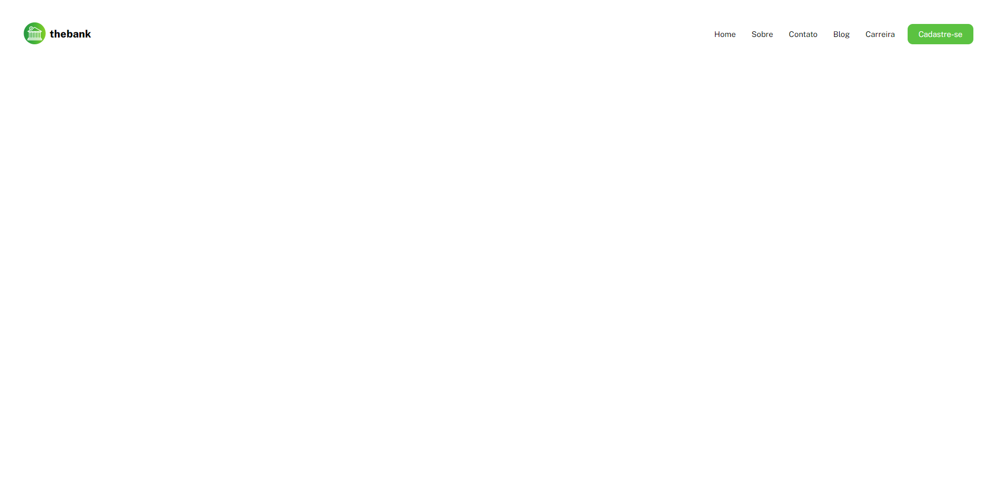
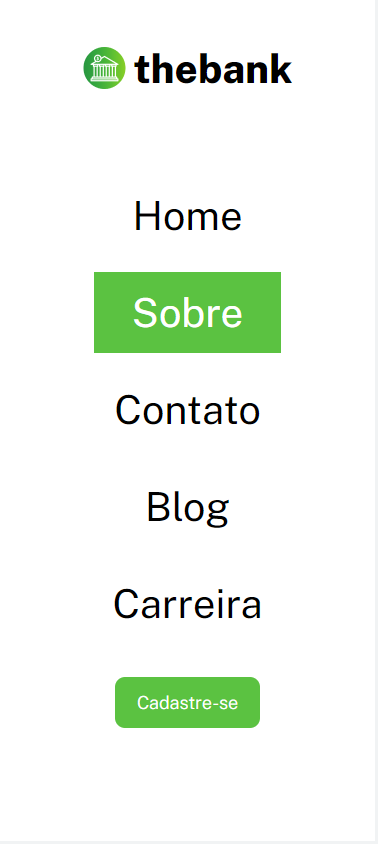

# 🎈Projeto - Menu Com Flexbox

## 📕Descrição

Neste projeto, criamos uma página onde o usuário pode visualizar o cabeçalho de uma página de um banco fictício.

Este projeto serve como uma página inicial do site do banco.

Para usuários que estiverem utilizando dispositivos móveis (celulares), a exibição da página inicial é vertical

 

## ❓Modo de Uso

Ao clicar em uma das seções do Menu ou na logo do banco, o usuário é redirecionado novamente para a página inicial.

Após a criação das outras seções, o usuário seria redirecionado para a página da seção em questão, porém por enquanto elas ainda não foram criadas.

 

## 💻Linguagens Utilizadas

- Html
- Css

 

## 📸Screenshots

 

### Desktop

### Mobile

## 🖊Autor: João Francisco Fortes André